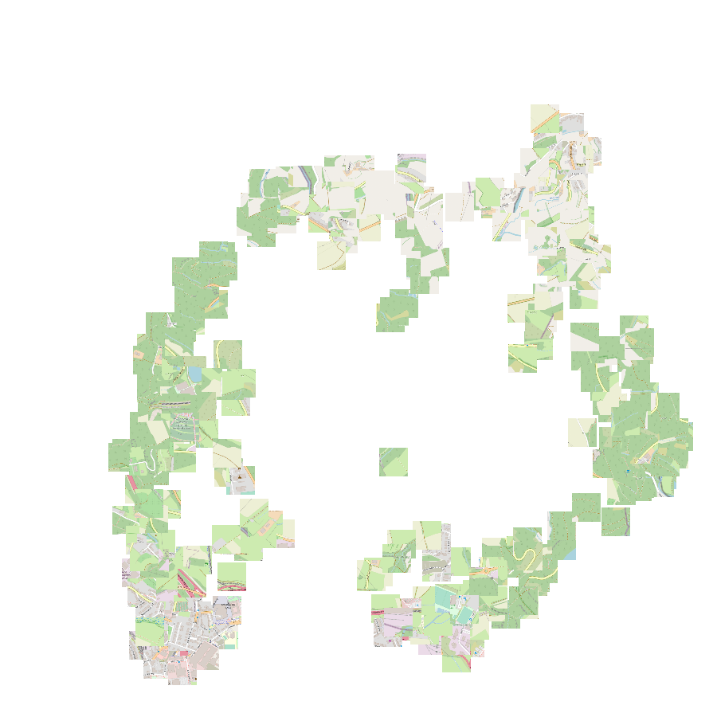

### Overview

Geobacter generates useful location embeddings on demand, it is an implementation of the [Loc2Vec](https://sentiance.com/2018/05/03/loc2vec-learning-location-embeddings-w-triplet-loss-networks/) blog post from [sentiance](https://sentiance.com/) 

A resnet is trained to embed renderings of geolocations using the triplet loss. Samples are generated based on the principle that:
> "Everything is related to everything else, but near things are more related than distant things"


Anchor | Positive | Negative
:-----:|:--------:|:--------:
 |  | 

### Setup

Initialise the open street map tile volumes and server
```bash
docker volume create openstreetmap-data
docker volume create openstreetmap-rendered-tiles

docker run \
    -e THREADS=12 \
    -v $PWD/data/osm/luxembourg-latest.osm.pbf:/data.osm.pbf \
    -v openstreetmap-data:/var/lib/postgresql/12/main \
    overv/openstreetmap-tile-server \
    import
```

```bash
export PYTHONPATH=$PYTHONPATH:$PWD/geobacter
```

Create a python environment (for training)
```bash
pipenv install --dev
pipenv shell
```

Create a python environment (for inference)
```bash
pipenv install
pipenv shell
```

Start the open street map tile server
```bash
docker-compose up
```

### Train

Initialise some training and testing samples (which also caches tiles)
```bash
python bin/generate_samples.py --sample-count 100000 --buffer 100 --distance 500 --seed 1 --path data/extents/train_100000.json
python bin/generate_samples.py --sample-count 10000 --buffer 100 --distance 500 --seed 2 --path data/extents/test_10000.json
```

```bash
python -m geobacter.train
```

### Run

(optional) Check that the open street map tile server is up
```bash
curl localhost:8080/tile/16/33879/22296.png --output test.png
```

Start the python service
```bash
export GEOBACTER_TOKEN=<token>
gunicorn -b 0.0.0.0:8000 --workers 4 --timeout 10 geobacter.inference.api:app
```


### Results

Semantically similar locations are embedded together



The embedding space can be interpolated


Similar locations can be queried


